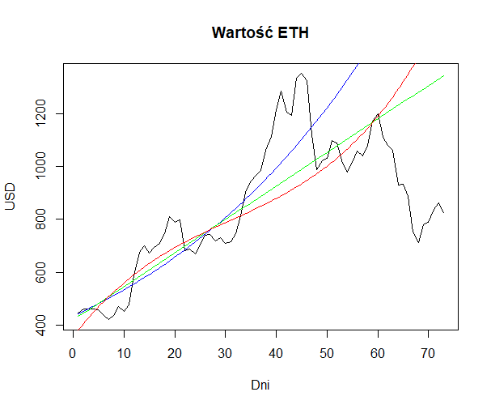

# Analiza-danych-regresje

Projekt nr.1 na zaliczenie Analizy danych  
Uniwersytet Gdański - Matematyka  

Wykresy:

1. Wartości ETH w dniach od 2015-08-06 do 2018-08-31:

2. Wartości ETH w dniach od 2017-12-01 do 2018-01-04:

3. Nakładanie regresji na wykres:

Regresja wykładnicza - niebieska krzywa na wykresie  
Regresja liniowa - zielona linia na wykresie  
Regresja wieloraka - czerwona krzywa na wykresie 

4. Wykres dla kolejnych dni (te same regresje):

